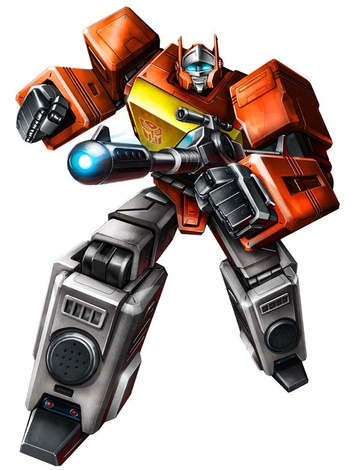
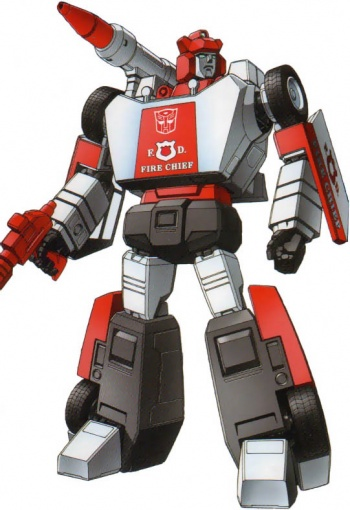

<h1 align="center">Autobot blueprints</h1>

<p align="center">
  Ready-to-use templates for <a href="https://github.com/crystal-autobot/autobot">Autobot</a> — your AI-powered assistant framework.<br/>
  Pick a blueprint, customize, and deploy in minutes.
</p>

<p align="center">
  <a href="#blueprints">Blueprints</a> &bull;
  <a href="#getting-started">Getting started</a> &bull;
  <a href="#customization">Customization</a>
</p>

---

## Blueprints

| | Blueprint | Description | Features |
|---|---|---|---|
|  | **[Optimus](autobots/optimus/)** | General-purpose autobot with all features enabled | Telegram, Slack, web search, image generation, sandbox, MCP, custom skills |
|  | **[Bumblebee](autobots/bumblebee/)** | Training assistant with fitness integrations | Strava, Garmin, workout tracking, training plans, progress charts |
|  | **[Blaster](autobots/blaster/)** | Language learning companion | Conversation practice, vocabulary tracking, quizzes, flashcards |
|  | **[Red Alert](autobots/red-alert/)** | Smart home monitor connected to Home Assistant | Device control, sensor charts, air quality tracking, automations |

---

## Getting started

### Prerequisites

- [Autobot](https://github.com/crystal-autobot/autobot) installed (`brew install crystal-autobot/tap/autobot` or build from source)
- [uv](https://docs.astral.sh/uv/) (required for MCP servers)
- [Docker](https://www.docker.com/) (optional, for sandboxed execution)

### Quick start

```bash
# 1. Clone this repo
git clone https://github.com/crystal-autobot/blueprints.git
cd blueprints

# 2. Copy a blueprint to your working directory
cp -r autobots/optimus ~/my-autobot

# 3. Configure your API keys
cd ~/my-autobot
cp .env.example .env
# Edit .env with your actual keys

# 4. (Optional) Build sandbox image
docker build -t autobot-sandbox -f Dockerfile.sandbox .

# 5. Run
autobot gateway
```

---

## Customization

Each blueprint is a self-contained directory with the following structure:

```
blueprint/
├── config.yml              # Main configuration (model, channels, tools, MCP)
├── .env.example            # Environment variables template
├── .gitignore              # Sensible defaults for secrets and logs
├── Dockerfile.sandbox      # Custom sandbox image for code execution
└── workspace/
    ├── SOUL.md             # Bot personality and character
    ├── AGENTS.md           # Agent instructions and behavior rules
    ├── USER.md             # User preferences (timezone, language, style)
    └── skills/             # Custom skills (bash scripts, Python tools)
```

### Key files to customize

| File | What to change |
|------|---------------|
| `config.yml` | Model, channels, MCP servers, tool settings |
| `.env` | API keys and credentials |
| `workspace/SOUL.md` | Bot personality, tone, values |
| `workspace/AGENTS.md` | Behavior rules, response guidelines |
| `workspace/USER.md` | Your preferences and context |
| `workspace/skills/` | Add custom skills your bot can use |

### Switching models

Autobot supports multiple LLM providers. Change the model in `config.yml`:

```yaml
agents:
  defaults:
    model: "openai/gpt-4.1-mini"       # OpenAI
    # model: "anthropic/claude-sonnet-4-6" # Anthropic
    # model: "deepseek/deepseek-chat"   # DeepSeek
    # model: "gemini/gemini-2.5-flash"  # Google Gemini
```

### Adding MCP servers

Connect external services via MCP (Model Context Protocol):

```yaml
mcp:
  servers:
    my-server:
      command: "uvx"
      args: ["my-mcp-server"]
      env:
        API_KEY: "${MY_API_KEY}"
      tools: ["tool_one", "tool_two"]
```

---

## Documentation

New to Autobot? Start here:

- [Quick start](https://crystal-autobot.github.io/autobot/quickstart/) — installation and first run
- [Configuration](https://crystal-autobot.github.io/autobot/configuration/) — all config options explained
- [Providers](https://crystal-autobot.github.io/autobot/providers/) — choose and configure your LLM provider
- [Telegram](https://crystal-autobot.github.io/autobot/telegram/) — set up a Telegram bot
- [Slack](https://crystal-autobot.github.io/autobot/slack/) — set up a Slack bot
- [MCP servers](https://crystal-autobot.github.io/autobot/mcp/) — extend your bot with external tools
- [Sandboxing](https://crystal-autobot.github.io/autobot/security/) — secure code execution
- [Memory](https://crystal-autobot.github.io/autobot/memory/) — sessions and long-term memory

Full docs: [crystal-autobot.github.io/autobot](https://crystal-autobot.github.io/autobot/)

---

## Contributing

Have a cool autobot setup? Contributions are welcome!

1. Fork this repo
2. Create a new blueprint directory
3. Include a `README.md`, `config.yml`, `.env.example`, and workspace files
4. Submit a pull request

---

<p align="center">
  Built with <a href="https://github.com/crystal-autobot/autobot">Autobot</a>
</p>
