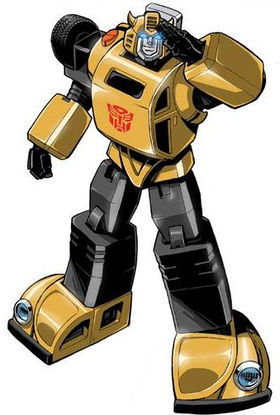

<p align="center">
  
</p>

<h1 align="center">Bumblebee</h1>

<p align="center">
  Training assistant with Strava and Garmin integrations.<br/>
  Your personal coach that tracks workouts, analyzes progress, and keeps you motivated.
</p>

---

## What's included

| Feature | Status | Details |
|---------|--------|---------|
| Telegram | Enabled | Streaming, training-specific commands |
| Garmin MCP | Enabled | Activity tracking, stats, health metrics |
| Strava MCP | Enabled | Activities, routes, segments, kudos |
| Web search | Enabled | Training articles, race info lookup |
| Sandbox execution | Docker | Python with matplotlib for charts |
| Training skill | Included | Weekly summaries, progress charts, workout logging |
| Memory | Enabled | Remembers your training history and goals |

## Documentation

- [Quick start](https://crystal-autobot.github.io/autobot/quickstart/) — install Autobot and run your first bot
- [Configuration](https://crystal-autobot.github.io/autobot/configuration/) — all config options explained

## Quick start

```bash
# Copy blueprint
cp -r autobots/bumblebee ~/my-training-bot
cd ~/my-training-bot

# Set up environment
cp .env.example .env
# Edit .env with your API keys

# Build sandbox (required for charts)
docker build -t bumblebee-sandbox -f Dockerfile.sandbox .

# Run
autobot gateway
```

## Configuration

### Channels

Update `allow_from` in `config.yml` with your Telegram username:

```yaml
channels:
  telegram:
    allow_from: ["your-username"]
```

### MCP servers

Two fitness MCP servers are pre-configured:

**Garmin** — pulls activities, stats, and health data from Garmin Connect:
```yaml
garmin:
  command: "uvx"
  args: ["--python", "3.12", "--from", "git+https://github.com/Taxuspt/garmin_mcp", "garmin-mcp"]
```

**Strava** — access your Strava activities, segments, and social features:
```yaml
strava:
  command: "uvx"
  args: ["--python", "3.12", "--from", "git+https://github.com/igolaizola/strava-mcp", "strava-mcp"]
```

### Custom commands

| Command | Description |
|---------|-------------|
| `/week` | Weekly training summary with totals and highlights |
| `/progress` | Training progress over the last 30 days |
| `/plan` | Show upcoming training plan for the week |

## Skills

### Training

Generates training progress charts and weekly summaries. Uses data from Garmin and Strava MCP servers, processes it with Python, and renders charts via matplotlib.

**Chart types:**
- **Weekly volume** — bar chart of distance/duration per day
- **Heart rate zones** — pie chart of time in each HR zone
- **Progress over time** — line chart of weekly mileage trends
- **Activity breakdown** — bar chart by sport type (running, cycling, swimming)

## Personality

Bumblebee is an energetic, supportive training buddy — always enthusiastic about your progress, encouraging on rest days, and data-driven in recommendations. Customize in `workspace/SOUL.md`.

## Environment variables

| Variable | Required | Description |
|----------|----------|-------------|
| `OPENAI_API_KEY` | Yes | OpenAI API key |
| `TELEGRAM_BOT_TOKEN` | Yes | Telegram bot token from @BotFather |
| `BRAVE_API_KEY` | No | Brave Search API key (for web search) |
| `GARMIN_EMAIL` | Yes* | Garmin Connect email |
| `GARMIN_PASSWORD` | Yes* | Garmin Connect password |
| `STRAVA_CLIENT_ID` | Yes* | Strava API application client ID |
| `STRAVA_CLIENT_SECRET` | Yes* | Strava API application client secret |
| `STRAVA_REFRESH_TOKEN` | Yes* | Strava API refresh token |

*Required if corresponding MCP server is enabled. Remove unused servers from `config.yml`.
